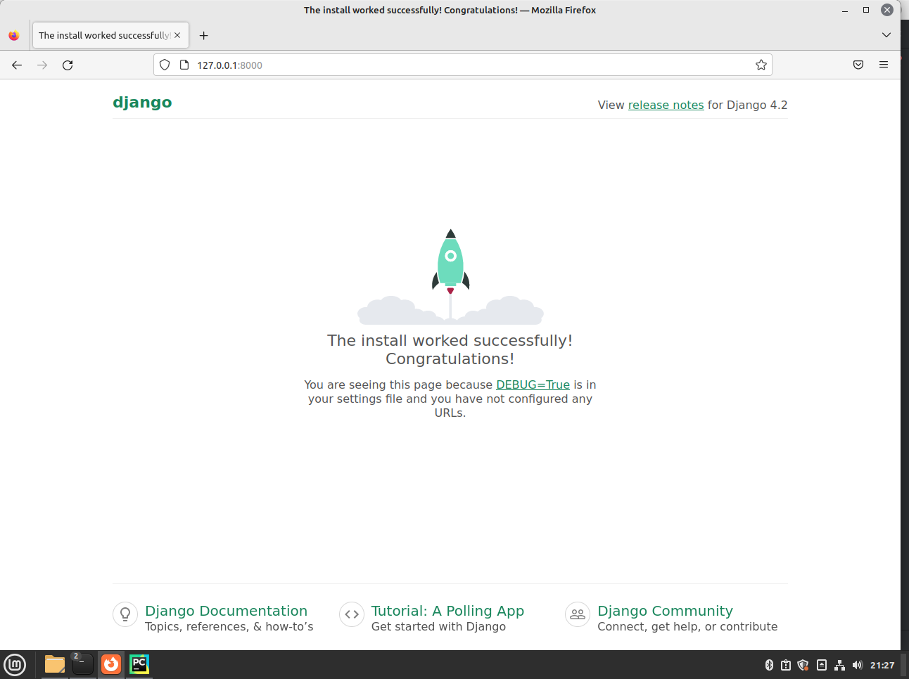
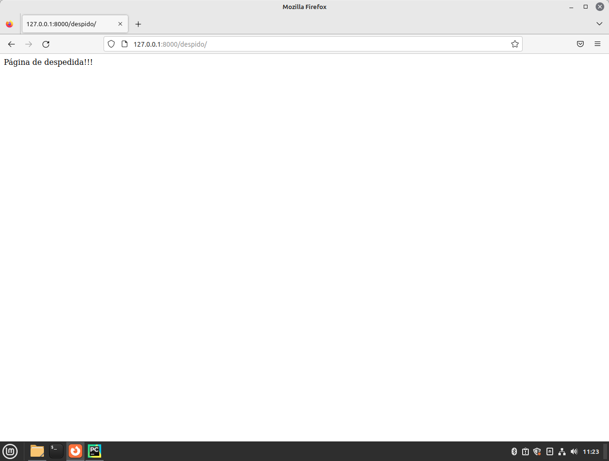
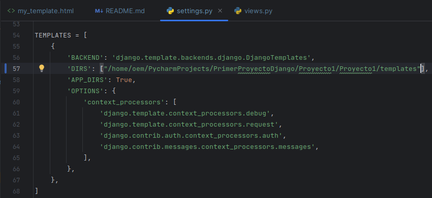

# PrimerProyectoDjango
Este es un primer proyecto de ejemplo con el framework Django.

## Django
- Djngo es un framework web gratuito y de código abierto escritoen Python.
- Un framework es un marco de trabajo formado por un conjunto de herramientas, librerías y buenas prácticas.

## Para qué sirve?

- Para crear sitios web complejos de forma rápida y sencilla.
- Facilitar tareas repetitivas, pesadas y comunes en el momento de crear un sitio web.
- Reutilizar código de un sitio web a otro de forma sencilla.

## Modelo Vista Controlador (MVC)

- **Modelo:** Base de datos - gestionar los datos
- **Vista:** Mostrar información al usuario, lo que ve, cómo interactúa
- **Controlador:** Gestionar la comunicación entre vista y el modelo.

## Model Template View (MTV)

- **Model:** sigue siendo el modelo
- **Template:** Vista
- **View:** Controlador

## Bases de datos soportados oficialmente por Django

- SQLite: Gestor de base de datos por defecto, viene incorporado en las últimas versiones de python, no se necesita instalar ni configurar nada.
- PostgresSQL: Gestor de base de datos recomendado.
- MySQL.
- Oracle.

## Bases de datos con conectores ofrecidos por terceros y que no son oficialmente soportados por Django:

- SQL Server.
- SAP SQL.
- DB2.
- Firebird.
- Otros.

**Nota:** Django está estructurado en base a MTV

## Instalación de Django

### Requisitos

- Tener Python instalado

### Comando pip

Nos debemos fijar desde la página oficial de Django, cuál es la última versión disponible.

- pip install Django==4.2.3
- Desde la consola de python: import django, django.VERSION

## Creación de un proyecto

- django-admin startproject ***"Nombre del Projecto"*** 
***Manage: permite interactuar con el proyecto de Django.***
- manage.py help: permite observar todas las utilidades de este archivo.
- __init__.py: permite que el proyecto funcione como un paquete.
- settings.py: contiene todas las configuraciones del proyecto de Django. También contiene las aplicaciones instaladas con Dajango **(INSTALLED_APPS)**.
- urls.py: almacena todas las urls utilizadas por el proyecto.
- wsgi.py: servidor web a utilizar en el proyecto Django.

## Activar proyecto y crear base de datos (Migrate)

Es necesario paa que todas las aplicaciones que vienen con Django y se conectan con la base de datos, comiencen a funcionar, es decir, para que el proyecto comience a funcionar.

- python manage.py migrate

***Nota: se genera en la carpeta del proyecto un archivo db.sqlite3 (base de datos)***

## Arrancar servidor web

- python manage.py runserver

En este momento ya el proyecto está corriendo y se puede probar desde un explorador web. Por defecto, el proyecto ya viene con un servidor web para pruebas (no para producción)

http://127.0.0.1:8000/

## Creación de una página

- Crear un archivo el cual contendrá las vistas que se vayan creando: por convención, se puede llamar views.py y debe quedar en el directorio interno del proyecto **(Proyecto/Proyecto)**.
- from django.http import HttpResponse.
- Programar cada una de las vistas.
- Incluir cada vista en urls.py **(cada url debe llamar una vista)**.
- Recordar volver al correr el servidor web **(python manage.py runserver)**.

## Templates

1. Creación de objeto tipo Template.
plc=Template(doc_externo.read())
2. Creación de contexto: datos adicionales para template (variables, funciones, etc).
ctx=Context()
3. Renderizar el objetip de tipo Template.
documento=plt.render(ctx)

## Nomenclatura del punto (.)

Se usas para acceder a diccionarios, atributos, métodos e índices de lista. Su prioridad es la siguiente:

1. Diccionario
2. Atributo.
3. Método.
4. índice de lista.

## Loader: cargar plantillas
1. from django.template import loader, tiene un método get_template

2. En el archivo settings se debe indicar la ruta de las plantillas: TEMPLATES-'DIRS' (se debe especificar en esa lista la cual está dentro del diccionario TEMPLATES): 'DIRS: ["/home/oem/PycharmProjects/PrimerProyectoDjango/Proyecto1/Proyecto1/templates"]'

3. Completar el código:

- doc_externo = loader.get_template('my_template.html')
- documento = doc_externo.render(dictionary)
- return HttpResponse(documento)

## Simplificación de código con shorcuts

1. from django.shortcuts import render
2. return render(request, 'my_template.html', dictionary)

https://docs.djangoproject.com/en/4.2/topics/http/shortcuts/

## Plantillas Incrustada 

1. Crear el código html de la plantalla que se quiere incrustar.
2. En la plantilla donde se quiere incrustar la anterior, agregar: 

## Herencia de Templates

1. En la plantilla padre se pueden agregar etiquetas como éstas: 
-  
-  

2. En las plantillas hijas se agregan las siguientes etiquetas:

- 
-  título 
-  contendio html